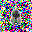

# Minimal Implementation of SODA for Novel View Synthesis

This repository contains a minimal implementation of the SODA method proposed in the paper [SODA: Bottleneck Diffusion Models for Representation Learning](https://arxiv.org/abs/2311.17901). This implementation focuses on a simplified version of the Novel View Synthesis (NVS) task using 3D datasets, as explored in the paper. I used the NMR (Neural 3D Mesh Renderer) dataset hosted by [Niemeyer et al.](https://github.com/autonomousvision/differentiable_volumetric_rendering) with the SoftRas split. While it could be applied to other datasets, the configuration files would need to be modified accordingly.

## Table of Contents

- [Minimal Implementation of SODA for Novel View Synthesis](#minimal-implementation-of-soda-for-novel-view-synthesis)
  - [Table of Contents](#table-of-contents)
  - [Introduction](#introduction)
  - [Simplifications](#simplifications)
  - [Issues](#issues)
  - [Installation](#installation)
  - [Usage](#usage)
    - [Training](#training)
    - [Sampling](#sampling)
    - [Evaluation](#evaluation)
  - [References](#references)

## Introduction

The SODA model leverages diffusion models for representation learning. Specifically, this approach involves training an encoder alongside a diffusion denoiser. The encoder's task is to produce latent vectors that guide the denoiser in generating intended targets. The trained encoder (which learns a compressed representation of the data) can later be used for downstream tasks.

:exclamation: **Note:** This implementation focuses only on the NVS task, while the original paper includes various tasks showcasing the versatility of SODA.

## Simplifications

The following are the differences between this implementation and the original paper:

1. I have not implemented the cross-attention mechanism for conditioning on the latent code, as described in the original paper (this improves performance on 3D datasets).
2. The original paper suggests splitting the latent vector into \(m+1\) sub-vectors and applying layer-wise modulation for each layer in the denoiser U-Net. Instead, I used the full latent vector for feature modulation using AdaGN. This is because latent disentanglement was not the goal of my project.
3. While the original paper uses 256×256 images for the encoder and 128×128 for the denoiser (NMR images are 64×64), I trained both networks with 32x32 images.
4. The authors mention projecting 6D rays (\[o, d\]) onto a sphere to create a 512-dimensional encoding. I didn't fully understand this step, so I used 6D rays and applied scaled sinusoidal positional encoding to produce 288-dimensional vectors (adjustable with frequency band \(L\)) following NeRF-style encoding.

## Issues

Currently, the model fails to generate high-quality samples, though the generated camera views are fairly accurate. Unfortunately, due to the high computational cost of training, I couldn't experiment with different hyperparameters to optimize the model to match the quality demonstrated in the paper. I believe the encoder is performing well, but the denoiser lacks the capacity to produce high-quality samples.

## Installation

In addition to the requirements listed in `requirements.txt`, the project requires `p7zip` for faster dataset extraction.

1. Clone the repository:

    ```bash
    git clone https://github.com/mosix11/SODA-NVS-Implementation.git
    ```

2. Install dependencies:

    ```bash
    pip install -r requirements.txt
    ```

## Usage

### Training

The training configuration is specified in the `configs/NMR.yaml` file. You can change it if you want to modify the model or training hyperparameters.
To start the training, you simply run the train script:

```bash
python train.py
```

and in order to resume training:

```bash
python train.py --resume
```

### Sampling

To sample all 24 views of an object from the test set, you can run the sample script by inputting the an object index or the script will take a random sample form the test set and generates 24 target views for this sample using one source view.

```bash
python sample.py --objidx 1000
```

<p align="center">
<div style="display: flex; flex-direction: column; align-items: center; gap: 20px;">
    <!-- First Line: Three Images -->
    <div style="display: flex; justify-content: space-between; width: 100%; max-width: 1000px;">
        
        
        
    </div>
    <div style="display: flex; justify-content: center; gap: 200px;">
        
        
    </div>
</div>
</p>

### Evaluation

To evaluate the classification performance of the trained encoder, you can run the evaluation script:

```bash
python evaluate.py --type lp
```

To evaluate the FID score of the images generated by the diffusion model guided by the encoder, you can run the evaluation script:

```bash
python evaluate.py --type FID
```

To evaluate the SSIM score:

```bash
python evaluate.py --type SSIM
```

## References

```bibtex
@article{hudson2023soda,
  title={SODA: Bottleneck Diffusion Models for Representation Learning},
  author={Hudson, Drew A and Zoran, Daniel and Malinowski, Mateusz and Lampinen, Andrew K and Jaegle, Andrew and McClelland, James L and Matthey, Loic and Hill, Felix and Lerchner, Alexander},
  journal={arXiv preprint arXiv:2311.17901},
  year={2023}
}

@misc{futurexiang2023soda,
  title={Un Official Impelementation of SODA GitHub Repository},
  author={FutureXiang},
  year={2023},
  howpublished={\url{https://github.com/FutureXiang/soda/tree/main}}
}
```
